# 싸멘틀(SSAmantle) 클래스 다이어그램

## 문서 정보
- **프로젝트명**: 싸멘틀 (SSAmantle)
- **버전**: 1.0
- **최종 수정일**: 2025-12-24
- **작성자**: Development Team

---

## 목차
1[전체 레이어 종합 클래스 다이어그램](#7-전체-레이어-종합-클래스-다이어그램)

---

## 1. 전체 레이어 종합 클래스 다이어그램

### 헥사고날 아키텍처 - 전체 레이어 통합뷰 (일반 패턴)

```mermaid
classDiagram
    %% ========================================
    %% Inbound Adapters (HTTP Layer)
    %% ========================================
    namespace InboundAdapters {
        class XXXController {
            -XXXUseCase xxxUseCase
            -YYYUseCase yyyUseCase
            +xxxEndpoint(request, userId) ApiResponse
            +yyyEndpoint(request, userId) ApiResponse
        }
    }

    %% ========================================
    %% Application Layer - Inbound Ports
    %% ========================================
    namespace InboundPorts {
        class XXXUseCase {
            <<interface>>
            +execute(XXXCommand) XXXResponse
        }
    }

    %% ========================================
    %% Application Layer - Services
    %% ========================================
    namespace ApplicationServices {
        class XXXService {
            -LoadXXXPort loadXxxPort
            -SaveXXXPort saveXxxPort
            -CalculateYYYPort calculateYyyPort
            +execute(XXXCommand) XXXResponse
        }
    }

    %% ========================================
    %% Domain Layer
    %% ========================================
    namespace DomainLayer {
        class DomainEntity {
            -Long id
            -ValueObjectA valueObjectA
            -ValueObjectB valueObjectB
            +domainMethod() void
            +anotherDomainMethod() void
        }

        class ValueObjectA {
            -String value
            +of(String value)$ ValueObjectA
            +validate() boolean
        }

        class ValueObjectB {
            -Type value
            +of(Type value)$ ValueObjectB
        }
    }

    %% ========================================
    %% Application Layer - Outbound Ports
    %% ========================================
    namespace OutboundPorts {
        class LoadXXXPort {
            <<interface>>
            +loadById(Long id) DomainEntity
            +loadByCondition(...) List~DomainEntity~
        }

        class SaveXXXPort {
            <<interface>>
            +save(DomainEntity entity) DomainEntity
        }

        class UpdateXXXPort {
            <<interface>>
            +update(DomainEntity entity) void
        }

        class CalculateYYYPort {
            <<interface>>
            +calculate(Param param) Result
        }
    }

    %% ========================================
    %% Outbound Adapters - RDB
    %% ========================================
    namespace RDBAdapters {
        class XXXPersistenceAdapter {
            -XXXMapper xxxMapper
            +loadById(Long id) DomainEntity
            +save(DomainEntity entity) DomainEntity
            +update(DomainEntity entity) void
        }
    }

    %% ========================================
    %% Outbound Adapters - Redis
    %% ========================================
    namespace RedisAdapters {
        class YYYRedisAdapter {
            -RedisTemplate redisTemplate
            +loadFromCache(Key key) Value
            +saveToCache(Key key, Value value) void
        }
    }

    %% ========================================
    %% Outbound Adapters - External API
    %% ========================================
    namespace ExternalAdapters {
        class ZZZExternalAdapter {
            -WebClient webClient
            +callExternalApi(Request request) Response
        }
    }

    %% ========================================
    %% Infrastructure
    %% ========================================
    namespace Infrastructure {
        class SecurityProvider {
            +generateToken(...) String
            +validateToken(String token) boolean
        }

        class GlobalExceptionHandler {
            +handleException(...) ApiResponse
        }
    }

    %% ========================================
    %% Dependencies - Inbound
    %% ========================================
    XXXController ..> XXXUseCase : depends on
    XXXUseCase <|.. XXXService : implements

    %% ========================================
    %% Dependencies - Domain
    %% ========================================
    XXXService --> DomainEntity : uses
    XXXService --> ValueObjectA : validates
    XXXService --> ValueObjectB : creates

    DomainEntity *-- ValueObjectA : contains
    DomainEntity *-- ValueObjectB : contains

    %% ========================================
    %% Dependencies - Outbound Ports
    %% ========================================
    XXXService ..> LoadXXXPort : depends on
    XXXService ..> SaveXXXPort : depends on
    XXXService ..> CalculateYYYPort : depends on

    %% ========================================
    %% Dependencies - Outbound Adapters
    %% ========================================
    LoadXXXPort <|.. XXXPersistenceAdapter : implements
    SaveXXXPort <|.. XXXPersistenceAdapter : implements
    UpdateXXXPort <|.. XXXPersistenceAdapter : implements

    CalculateYYYPort <|.. YYYRedisAdapter : implements
    CalculateYYYPort <|.. ZZZExternalAdapter : implements

    %% ========================================
    %% Styling
    %% ========================================
    style XXXController fill:#c4e1ff
    style XXXUseCase fill:#e1c4ff
    style XXXService fill:#ffc4e1
    style DomainEntity fill:#ffe1c4
    style ValueObjectA fill:#fff4c4
    style ValueObjectB fill:#fff4c4
    style LoadXXXPort fill:#e1ffe1
    style SaveXXXPort fill:#e1ffe1
    style UpdateXXXPort fill:#e1ffe1
    style CalculateYYYPort fill:#e1ffe1
    style XXXPersistenceAdapter fill:#c4fff4
    style YYYRedisAdapter fill:#c4fff4
    style ZZZExternalAdapter fill:#c4fff4
```



#### 패턴 설명

| 패턴 | 설명 | 실제 예시 |
|------|------|---------|
| **XXXController** | HTTP 요청을 받는 컨트롤러 | GameController, UserController |
| **XXXUseCase** | 애플리케이션 진입점 인터페이스 (Inbound Port) | SubmitGuessUseCase, SignUpUseCase |
| **XXXService** | UseCase 구현체 | SubmitGuessService, SignUpService |
| **DomainEntity** | 도메인 엔티티 | User, Problem, Record |
| **ValueObjectA/B** | 값 객체 | Email, Password, Nickname |
| **LoadXXXPort** | 조회용 Outbound Port | LoadUserByIdPort, LoadTodayProblemPort |
| **SaveXXXPort** | 저장용 Outbound Port | SaveUserPort, SaveRecordPort |
| **UpdateXXXPort** | 수정용 Outbound Port | UpdateUserPort, UpdateRecordPort |
| **CalculateYYYPort** | 계산/처리용 Outbound Port | CalculateSimilarityPort |
| **XXXPersistenceAdapter** | RDB 영속성 어댑터 | UserPersistenceAdapter, RecordPersistenceAdapter |
| **YYYRedisAdapter** | Redis 캐시 어댑터 | GameRedisAdapter, LeaderboardRedisAdapter |
| **ZZZExternalAdapter** | 외부 API 어댑터 | InferenceSimilarityAdapter |
| **SecurityProvider** | 보안 관련 인프라 | JwtProvider |
| **GlobalExceptionHandler** | 전역 예외 처리 | GlobalExceptionHandler |
```

---

**END OF DOCUMENT**
