# 싸멘틀(SSAmantle) 프로젝트 요구사항 정의서

## 문서 정보
- **프로젝트명**: 싸멘틀 (SSAmantle)
- **버전**: 1.0
- **최종 수정일**: 2025-12-24
- **작성자**: Development Team

---

## 목차
1. [프로젝트 개요](#1-프로젝트-개요)
2. [시스템 다이어그램](#2-시스템-다이어그램)
3. [비즈니스 요구사항](#3-비즈니스-요구사항)
4. [기능 요구사항](#4-기능-요구사항)
5. [비기능 요구사항](#5-비기능-요구사항)
6. [시스템 아키텍처 요구사항](#6-시스템-아키텍처-요구사항)
7. [데이터 요구사항](#7-데이터-요구사항)
8. [외부 시스템 연동 요구사항](#8-외부-시스템-연동-요구사항)
9. [제약사항 및 전제조건](#9-제약사항-및-전제조건)

---

## 1. 프로젝트 개요

### 1.1 프로젝트 목적
싸멘틀(SSAmantle)은 **SSAFY(싸피) + Semantle(의미 기반 단어 추론 게임)**을 결합한 단어 추론 게임 플랫폼입니다. 사용자는 매일 제시되는 정답 단어를 의미 유사도를 기반으로 추론하여 맞추는 게임을 즐길 수 있습니다.

### 1.2 프로젝트 배경
- Word2Vec 등의 자연어 처리 기술을 활용한 의미 기반 단어 유사도 계산
- 매일 새로운 문제를 제공하여 지속적인 사용자 참여 유도
- 경쟁 요소(리더보드)와 성취 요소(업적 시스템)를 통한 동기부여

### 1.3 주요 사용자
- SSAFY 교육생 및 수료생
- 단어 퍼즐 게임을 즐기는 일반 사용자
- 한국어 어휘력 향상에 관심 있는 학습자

### 1.4 핵심 가치
- **학습성**: 단어의 의미적 관계를 이해하며 어휘력 향상
- **경쟁성**: 일일 리더보드를 통한 실력 경쟁
- **지속성**: 연속 풀이 시스템(스트릭)을 통한 꾸준한 참여 유도
- **성취감**: 업적 시스템을 통한 자기 발전 추적

---

## 2. 시스템 다이어그램

### 2.1 Use Case 다이어그램

#### 2.1.1 전체 시스템 Use Case
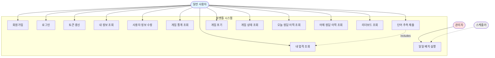

#### 2.1.2 게임 플레이 Use Case (상세)
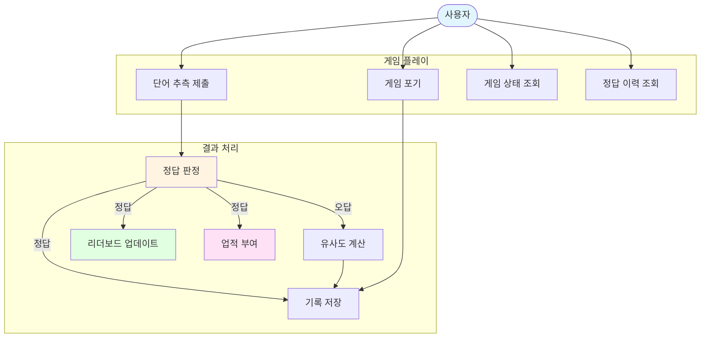

### 9.2 시스템 컨텍스트 다이어그램 (C4 Level 1)

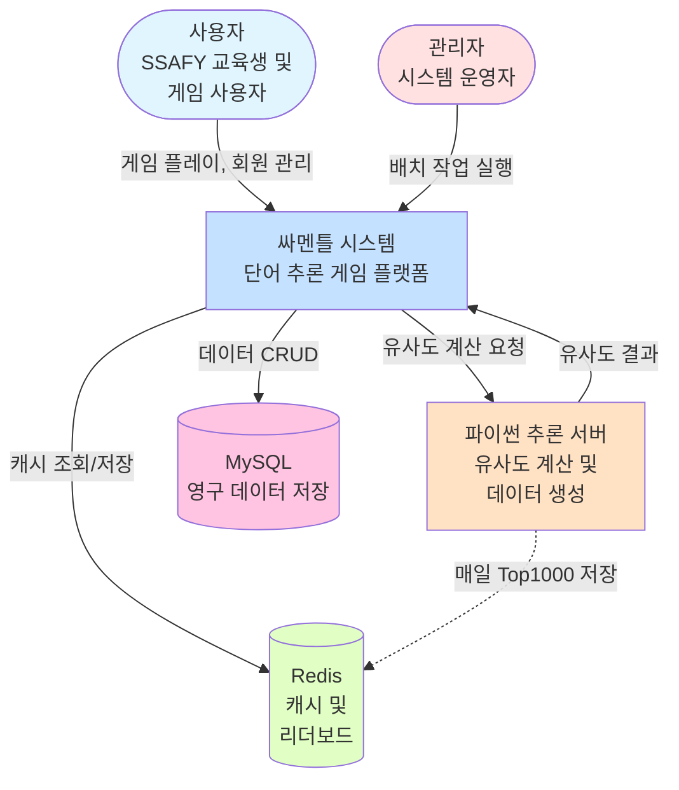

### 7.3 컨테이너 다이어그램 (C4 Level 2)

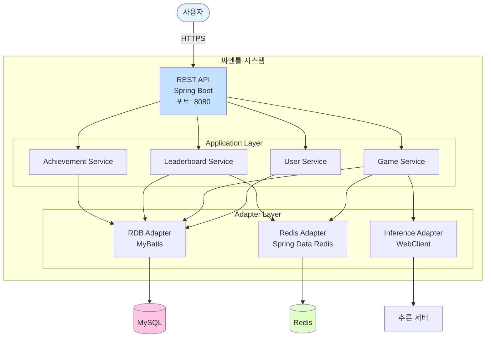

### 2.4 헥사고날 아키텍처 다이어그램

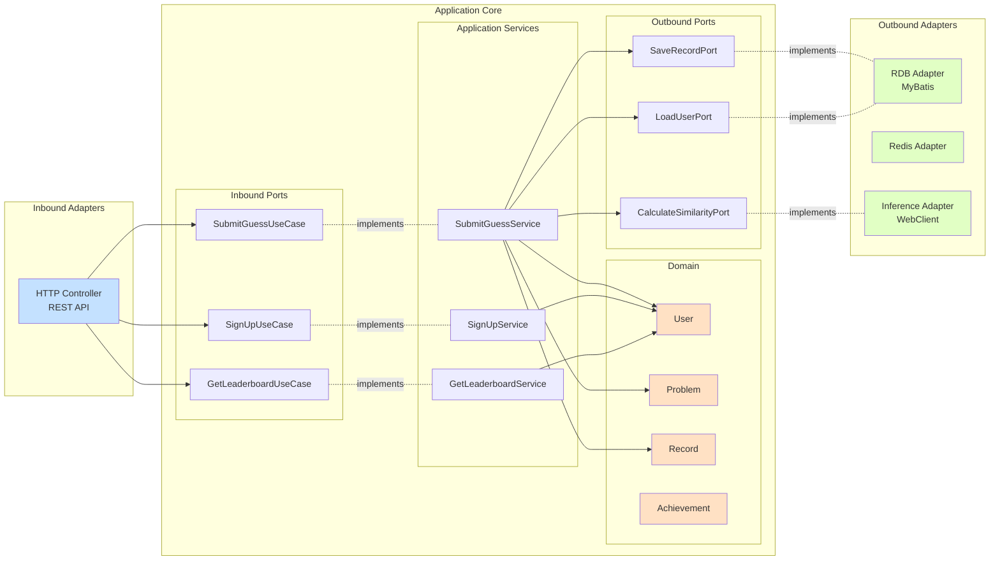

### 2.5 주요 시퀀스 다이어그램

#### 2.5.1 로그인 시퀀스
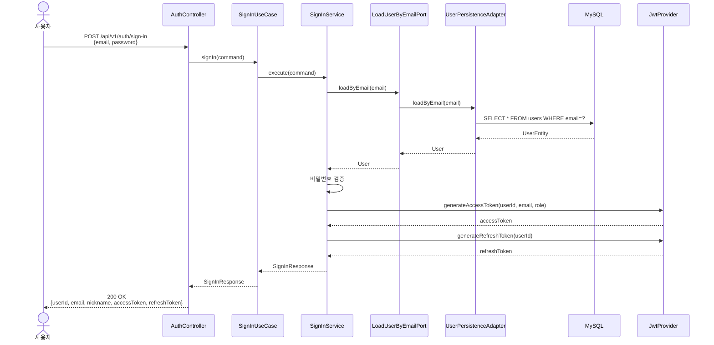

#### 2.5.2 단어 추측 제출 시퀀스 (정답인 경우)
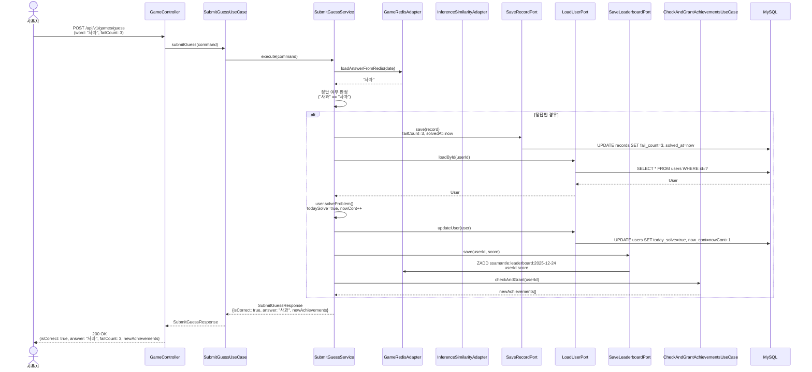

#### 2.5.3 단어 추측 제출 시퀀스 (오답인 경우)
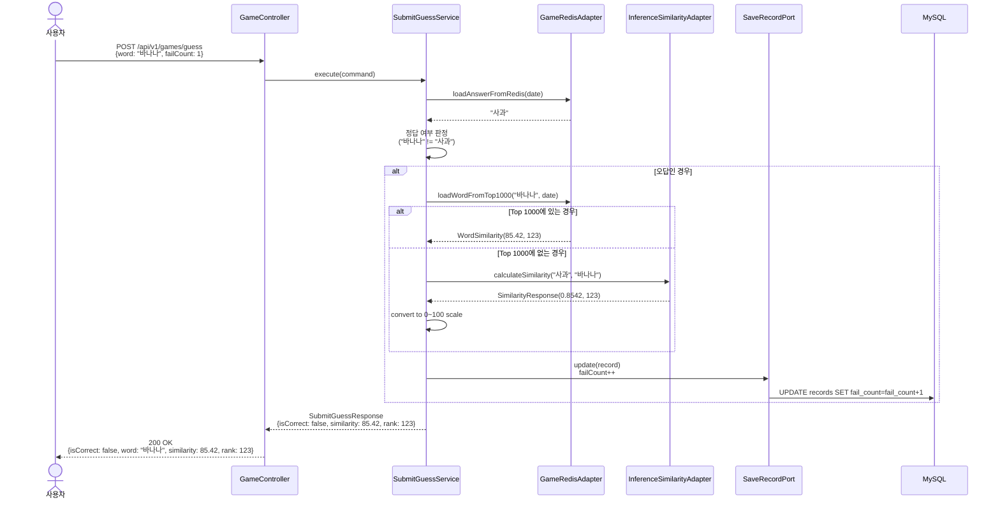

#### 2.5.4 리더보드 조회 시퀀스
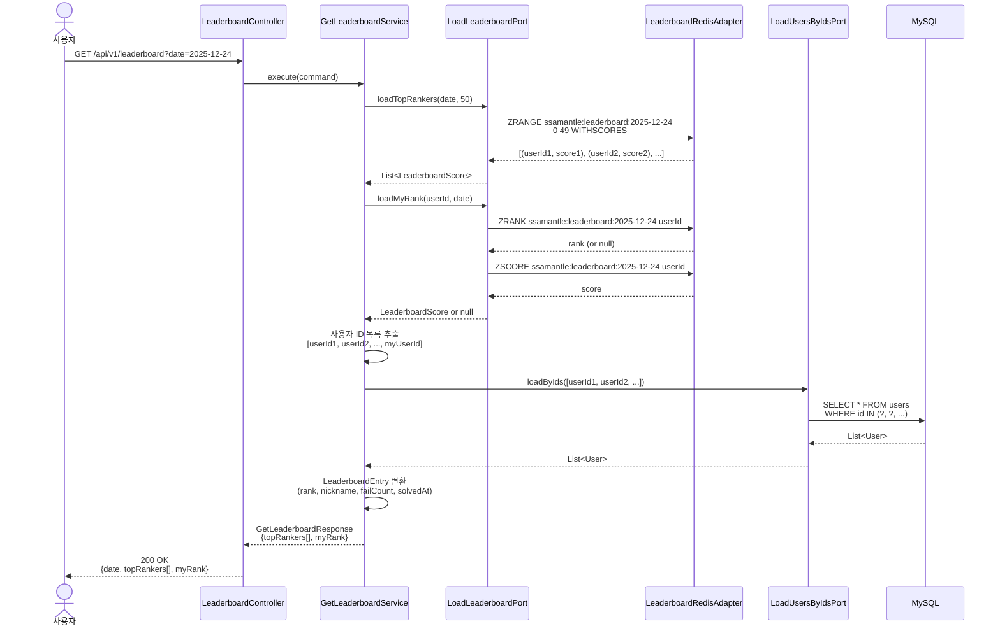

#### 2.5.5 일일 배치 작업 시퀀스
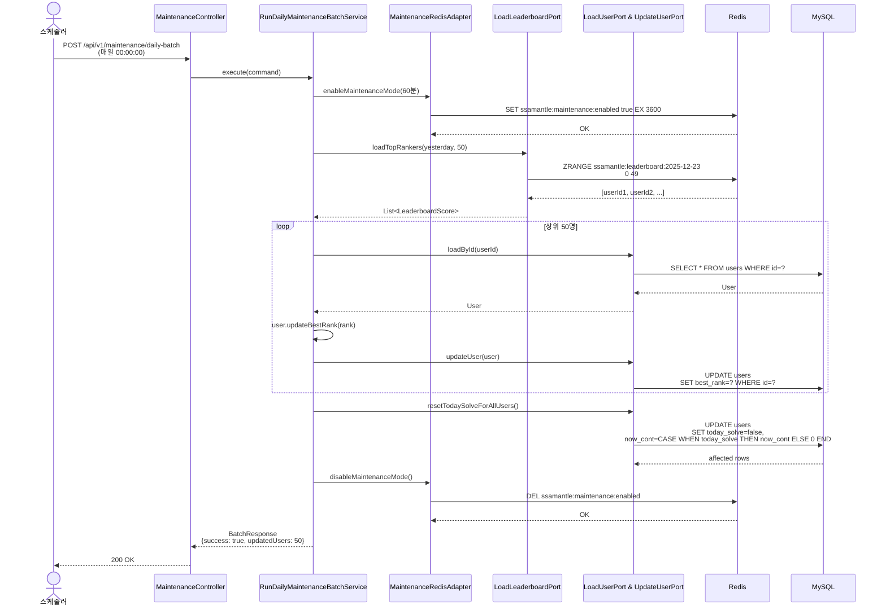

### 2.6 데이터 흐름 다이어그램

#### 2.6.1 게임 데이터 흐름
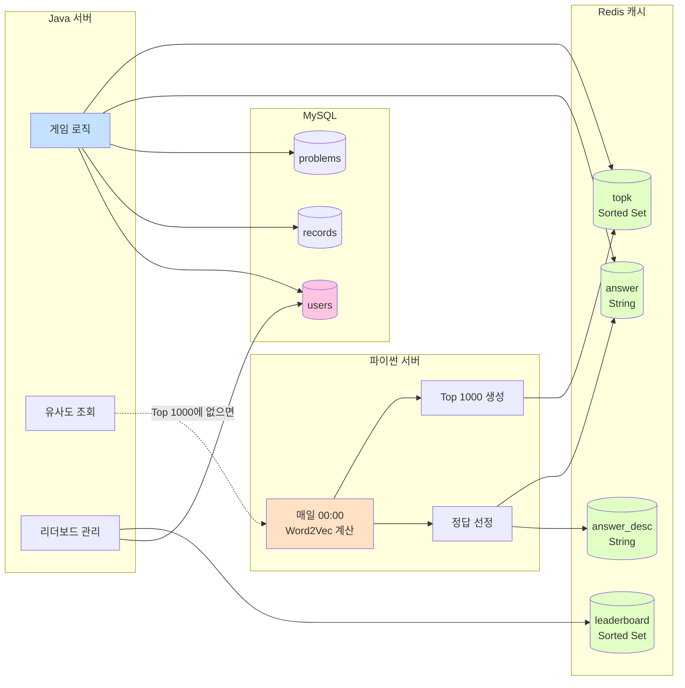

#### 2.6.2 업적 시스템 데이터 흐름
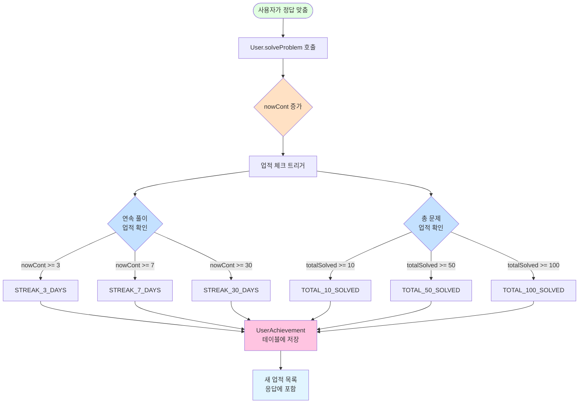

### 2.7 배포 다이어그램

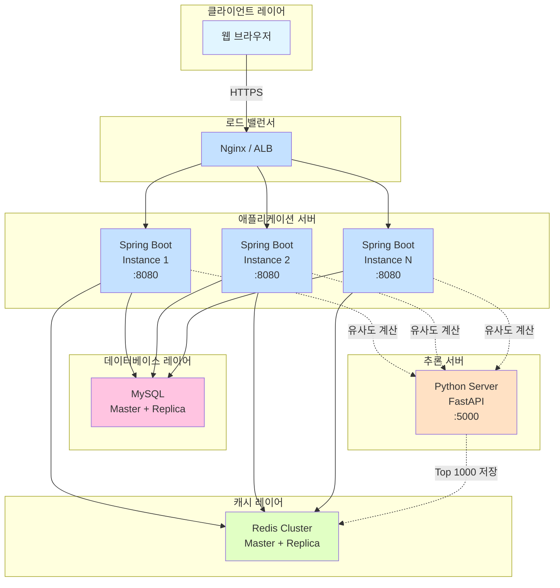

---

## 3. 비즈니스 요구사항

### 9.1 비즈니스 목표
1. **일일 활성 사용자(DAU) 증대**: 매일 새로운 문제를 제공하여 사용자의 일일 방문 유도
2. **사용자 유지율 향상**: 연속 풀이 시스템과 업적을 통한 장기 사용자 확보
3. **커뮤니티 형성**: 리더보드를 통한 경쟁과 소속감 형성

### 9.2 핵심 성과 지표(KPI)
- 일일 활성 사용자 수(DAU)
- 사용자 평균 연속 풀이 일수
- 문제 해결률 (성공한 게임 / 전체 게임)
- 평균 시도 횟수
- 리더보드 상위 50위 진입 경쟁률

### 7.3 비즈니스 규칙
1. **일일 문제 제공**: 매일 자정(또는 지정된 시간)에 새로운 문제가 제공됨
2. **1인 1일 1문제**: 하나의 계정으로 하루에 하나의 문제만 풀이 가능
3. **연속 풀이 규칙**: 전날 문제를 풀지 않으면 연속 기록이 초기화됨
4. **리더보드 순위 결정**: 시도 횟수가 적을수록, 같으면 빨리 푼 사람이 높은 순위

---

## 4. 기능 요구사항

### 9.1 사용자 관리 (User Management)

#### 5.1.1 회원가입 (FR-U-001)
**설명**: 신규 사용자가 이메일, 비밀번호, 닉네임을 입력하여 계정을 생성합니다.

**입력**:
- 이메일 (필수, 이메일 형식)
- 비밀번호 (필수, 8자 이상, 영문 대소문자, 숫자, 특수문자 포함)
- 닉네임 (필수, 3~20자)

**처리 로직**:
1. 이메일 형식 유효성 검증
2. 이메일 중복 확인
3. 비밀번호 복잡도 검증
4. 닉네임 길이 및 중복 확인
5. 비밀번호 암호화 (BCrypt 등)
6. 사용자 정보 저장 (기본 role: CUSTOMER)

**출력**:
- 성공: 사용자 ID, 이메일, 닉네임, 역할
- 실패: 에러 코드 및 메시지

**예외 케이스**:
- 이메일 형식 오류 → USER_001
- 이메일 중복 → USER_002
- 닉네임 중복 → USER_003
- 비밀번호 유효성 실패 → VALIDATION_ERROR

**API**: `POST /api/v1/users`

#### 5.1.2 로그인 (FR-U-002)
**설명**: 등록된 사용자가 이메일과 비밀번호로 인증하여 JWT 토큰을 발급받습니다.

**입력**:
- 이메일
- 비밀번호

**처리 로직**:
1. 이메일로 사용자 조회
2. 비밀번호 일치 여부 확인
3. JWT Access Token 발급 (유효기간: 1시간)
4. JWT Refresh Token 발급 (유효기간: 7일)

**출력**:
- 성공: userId, email, nickname, role, accessToken, refreshToken
- 실패: 에러 코드 및 메시지

**예외 케이스**:
- 이메일 또는 비밀번호 불일치 → A001
- 탈퇴한 사용자 → USER_100

**API**: `POST /api/v1/auth/sign-in`

#### 5.1.3 토큰 갱신 (FR-U-003)
**설명**: Refresh Token을 사용하여 새로운 Access Token을 발급받습니다.

**입력**:
- refreshToken

**처리 로직**:
1. Refresh Token 유효성 검증
2. 새로운 Access Token 발급
3. 새로운 Refresh Token 발급 (선택적)

**출력**:
- 성공: accessToken, refreshToken
- 실패: 에러 코드 및 메시지

**API**: `POST /api/v1/auth/refresh`

#### 5.1.4 내 정보 조회 (FR-U-004)
**설명**: 로그인한 사용자가 자신의 기본 정보를 조회합니다.

**입력**:
- JWT Access Token (Authorization Header)

**처리 로직**:
1. 토큰에서 userId 추출
2. 사용자 정보 조회
3. 응답 DTO 변환

**출력**:
- userId, email, nickname, role

**API**: `GET /api/v1/users/me`

#### 4.1.5 사용자 정보 수정 (FR-U-005)
**설명**: 로그인한 사용자가 비밀번호 또는 닉네임을 수정합니다.

**입력**:
- password (선택적)
- nickname (선택적)
- 최소 하나 이상 포함

**처리 로직**:
1. 토큰에서 userId 추출
2. 사용자 조회
3. 비밀번호 변경 시: 유효성 검증 → 암호화 → 업데이트
4. 닉네임 변경 시: 중복 확인 → 업데이트

**출력**:
- userId, email, nickname, message

**API**: `PATCH /api/v1/users/me`

#### 4.1.6 내 게임 통계 조회 (FR-U-006)
**설명**: 로그인한 사용자의 게임 플레이 통계를 조회합니다.

**입력**:
- JWT Access Token

**처리 로직**:
1. 사용자 ID로 전체 기록 조회
2. 통계 계산:
   - totalGamesPlayed: 전체 플레이 횟수
   - successfulGames: 성공한 게임 횟수
   - winRate: (successfulGames / totalGamesPlayed) * 100
   - bestRank: 최고 순위
   - longestConsecutiveDays: User.longestCont
   - averageAttempts: 평균 시도 횟수

**출력**:
- userId, totalGamesPlayed, successfulGames, winRate, bestRank, longestConsecutiveDays, averageAttempts

**API**: `GET /api/v1/users/me/statistics`

---

### 9.2 게임 플레이 (Game Play)

#### 5.2.1 단어 추측 제출 (FR-G-001)
**설명**: 사용자가 단어를 입력하여 오늘의 정답과의 유사도를 확인하고, 정답 여부를 판정받습니다.

**입력**:
- word: 추측 단어 (필수, 공백 불가)
- failCount: 현재 시도 횟수 (필수, 0 이상)

**처리 로직**:
1. Redis에서 오늘의 정답 조회 (캐시 우선)
2. Problem 조회 또는 생성
3. Record 조회 또는 생성 (첫 시도 시)
4. Record 상태 검증:
   - 이미 풀었으면 예외 발생 (G003)
   - 이미 포기했으면 예외 발생 (G004)
5. 정답 여부 판정:
   - **정답인 경우**:
     - Record.solve() 호출 (failCount 업데이트, solvedAt 기록)
     - User.solveProblem() 호출 (todaySolve = true, nowCont 증가)
     - 리더보드 업데이트 (failCount * 10^13 + epochMillis)
     - 업적 체크 및 부여
   - **오답인 경우**:
     - Top 1000에서 단어 조회 (Redis Sorted Set)
     - 없으면 추론 서버에 유사도 계산 요청
     - WordSimilarity 반환 (유사도 0.0~100.0, 순위)

**출력**:
- isCorrect: 정답 여부
- message: 응답 메시지
- word: 제출한 단어
- similarity: 유사도 (오답 시)
- rank: 순위 (오답 시, 1~10000)
- answer: 정답 단어 (정답 시)
- failCount: 시도 횟수
- newAchievements: 새로 획득한 업적 목록 (정답 시)

**예외 케이스**:
- 오늘의 문제 없음 → G001
- 이미 해결된 문제 → G003
- 이미 포기한 문제 → G004
- 단어 조회 실패 (추론 서버 에러) → G006
- 존재하지 않는 단어 → G007

**API**: `POST /api/v1/games/guess`

#### 5.2.2 게임 포기 (FR-G-002)
**설명**: 사용자가 현재 진행 중인 게임을 포기하고 정답을 확인합니다.

**입력**:
- JWT Access Token

**처리 로직**:
1. 사용자 ID로 오늘의 Record 조회
2. Record가 없거나 이미 완료된 경우 예외 발생 (G005)
3. Record.giveUp() 호출 (giveUpAt 기록)
4. 정답 조회
5. 연속 기록은 변경하지 않음 (일일 배치에서 처리)

**출력**:
- message: 포기 메시지
- answer: 정답 단어
- failCount: 최종 시도 횟수
- giveUpAt: 포기 시각

**예외 케이스**:
- 진행 중인 게임 없음 → G005

**API**: `POST /api/v1/games/give-up`

#### 5.2.3 게임 상태 조회 (FR-G-003)
**설명**: 사용자의 오늘 게임 진행 상태를 조회합니다.

**입력**:
- JWT Access Token

**처리 로직**:
1. 사용자 ID로 오늘의 Record 조회
2. Record가 없으면 NOT_STARTED
3. Record가 있으면:
   - solvedAt이 있으면 SOLVED
   - giveUpAt이 있으면 GAVE_UP
   - 둘 다 없으면 IN_PROGRESS

**출력**:
- status: NOT_STARTED | IN_PROGRESS | SOLVED | GAVE_UP
- failCount: 현재 시도 횟수

**API**: `GET /api/v1/games/status`

#### 5.2.4 오늘 정답 이력 조회 (FR-G-004)
**설명**: 오늘 문제의 정답과 유사도 상위 100개 단어를 조회합니다. 권한이 있는 경우(풀었거나 포기)만 정답을 볼 수 있습니다.

**입력**:
- JWT Access Token

**처리 로직**:
1. 오늘 Problem 조회
2. 사용자의 오늘 Record 조회
3. 권한 확인:
   - Record가 없거나 진행 중이면 answer와 top100Words를 null로 반환
   - 풀었거나 포기한 경우 정답 및 Top 100 반환
4. Redis에서 Top 100 단어 조회 (Sorted Set의 상위 100개)

**출력**:
- date: 날짜 (YYYY-MM-DD)
- answer: 정답 단어 (권한 없으면 null)
- top100Words: 상위 100개 단어 배열 (권한 없으면 null)
  - word: 단어
  - similarity: 유사도
  - rank: 순위

**API**: `GET /api/v1/games/answer-history/today`

#### 4.2.5 어제 정답 이력 조회 (FR-G-005)
**설명**: 어제 문제의 정답과 유사도 상위 100개 단어를 조회합니다. 권한 확인 없이 누구나 조회 가능합니다.

**입력**:
- JWT Access Token

**처리 로직**:
1. 어제 날짜 계산
2. 어제 Problem 조회
3. Redis에서 어제 Top 100 단어 조회

**출력**:
- date: 어제 날짜
- answer: 정답 단어
- top100Words: 상위 100개 단어 배열

**API**: `GET /api/v1/games/answer-history/yesterday`

---

### 7.3 리더보드 (Leaderboard)

#### 5.3.1 리더보드 조회 (FR-L-001)
**설명**: 특정 날짜의 리더보드 상위 랭커와 본인 순위를 조회합니다.

**입력**:
- date: 조회할 날짜 (선택, 기본값: 오늘)
- JWT Access Token

**처리 로직**:
1. 날짜 파라미터 파싱 (없으면 오늘)
2. Redis에서 해당 날짜의 리더보드 조회 (Sorted Set)
3. 상위 50명 조회 (ZRANGE)
4. 본인 순위 조회 (ZRANK)
5. 사용자 ID 목록으로 사용자 정보 일괄 조회 (N+1 방지)
6. LeaderboardEntry 변환

**출력**:
- date: 리더보드 날짜
- topRankers: 상위 50명 배열
  - rank: 순위 (1부터 시작)
  - nickname: 닉네임
  - failCount: 실패 횟수
  - solvedAt: 해결 시각
- myRank: 본인 순위 정보 (문제를 풀지 않았으면 null)

**순위 계산 공식**:
- score = failCount * 10^13 + epochMillis
- Redis Sorted Set의 오름차순 정렬 (score가 낮을수록 높은 순위)

**API**: `GET /api/v1/leaderboard?date=YYYY-MM-DD`

---

### 6.4 업적 시스템 (Achievement)

#### 5.4.1 업적 체크 및 부여 (FR-A-001)
**설명**: 사용자가 정답을 맞췄을 때 업적 조건을 확인하고, 새로 달성한 업적을 부여합니다.

**입력**:
- userId: 사용자 ID
- currentStreak: 현재 연속 풀이 일수
- totalSolved: 총 해결 문제 수

**처리 로직**:
1. User 조회 (nowCont 확인)
2. 총 해결 문제 수 조회 (Record 테이블)
3. 기존 획득 업적 조회
4. AchievementType.evaluateNewAchievements() 호출:
   - 모든 업적 타입 순회
   - 미달성 업적 중 조건 충족하는 것만 필터링
   - 연속 풀이 업적: nowCont >= requiredStreak
   - 총 문제 업적: totalSolved >= requiredCount
5. 새 업적 저장 (UserAchievement)

**출력**:
- 새로 획득한 업적 타입 목록

**업적 종류**:

**연속 풀이 업적**:
- STREAK_3_DAYS: 3일 연속 풀이
- STREAK_7_DAYS: 일주일 연속 풀이
- STREAK_30_DAYS: 한 달 연속 풀이

**총 문제 업적**:
- TOTAL_10_SOLVED: 문제 10개 해결
- TOTAL_50_SOLVED: 문제 50개 해결
- TOTAL_100_SOLVED: 문제 100개 해결

**호출 시점**: 정답을 맞췄을 때 자동 호출 (SubmitGuessService에서)

#### 5.4.2 내 업적 목록 조회 (FR-A-002)
**설명**: 로그인한 사용자가 획득한 모든 업적을 조회합니다.

**입력**:
- JWT Access Token

**처리 로직**:
1. 사용자 ID로 UserAchievement 조회
2. 최신순 정렬 (unlockedAt DESC)
3. 응답 DTO 변환

**출력**:
- userId: 사용자 ID
- achievements: 업적 배열
  - type: 업적 타입
  - title: 업적 제목
  - description: 업적 설명
  - unlockedAt: 획득 시각

**API**: `GET /api/v1/achievements/me`

---

### 6.5 일일 배치 작업 (Daily Maintenance)

#### 5.5.1 일일 유지보수 배치 (FR-M-001)
**설명**: 매일 자정(또는 지정 시간)에 실행되어 최고 순위를 갱신하고 연속 풀이 기록을 초기화합니다.

**입력**:
- 실행 시각 (스케줄러)

**처리 로직**:
1. **유지보수 모드 활성화**:
   - Redis에 maintenance:enabled 플래그 설정 (TTL: 60분)
   - API 요청 차단 (Interceptor에서 체크)
2. **전날 Top 50 조회**:
   - 전날 리더보드에서 상위 50명 추출
3. **최고 순위 갱신**:
   - Top 50 사용자의 User.bestRank 업데이트
   - user.updateBestRank(rank) 호출
4. **연속 풀이 초기화**:
   - 전체 사용자 조회
   - todaySolve가 false인 사용자: nowCont = 0
   - 모든 사용자: todaySolve = false
5. **유지보수 모드 해제**:
   - Redis maintenance:enabled 플래그 삭제

**예외 처리**:
- 배치 실패 시 유지보수 모드 자동 해제
- 실패 로그 기록
- 관리자 알림 (선택적)

**실행 주기**: 매일 00:00:00 (설정 가능)

**API**: `POST /api/v1/maintenance/daily-batch` (관리자 권한 필요)

---

## 5. 비기능 요구사항

### 9.1 성능 요구사항 (NFR-P)

#### NFR-P-001: 응답 시간
- API 응답 시간: 평균 200ms 이하, 95 percentile 500ms 이하
- 유사도 계산 API: 평균 300ms 이하 (추론 서버 응답 포함)
- Redis 캐시 조회: 10ms 이하

#### NFR-P-002: 동시 사용자
- 동시 접속 사용자 1,000명 이상 처리 가능
- 피크 시간대(저녁 8시~10시) 부하 테스트 통과

#### NFR-P-003: 데이터베이스 성능
- 쿼리 실행 시간: 평균 100ms 이하
- 인덱스 활용: userId, problemId, solvedAt 등 주요 컬럼
- N+1 쿼리 방지: 일괄 조회 전략 적용

#### NFR-P-004: 캐싱 전략
- Redis 캐시 히트율: 90% 이상
- Top 1000 단어: Redis Sorted Set 캐싱
- 정답 및 설명: Redis String 캐싱

### 9.2 보안 요구사항 (NFR-S)

#### NFR-S-001: 인증 및 인가
- JWT 기반 인증 사용
- Access Token 유효기간: 1시간
- Refresh Token 유효기간: 7일
- HTTPS 통신 강제 (프로덕션 환경)

#### NFR-S-002: 비밀번호 보안
- BCrypt 알고리즘 사용 (strength: 10 이상)
- 비밀번호 복잡도 검증: 8자 이상, 영문 대소문자, 숫자, 특수문자 포함
- 비밀번호 평문 저장 금지

#### NFR-S-003: 입력 검증
- 모든 사용자 입력에 대한 유효성 검증
- SQL Injection 방지: PreparedStatement 사용
- XSS 방지: 입력값 이스케이프 처리

#### NFR-S-004: API 보안
- CORS 설정: 허용된 도메인만 접근
- Rate Limiting: IP당 분당 60회 요청 제한
- API Key 기반 추론 서버 인증 (선택적)

### 7.3 가용성 요구사항 (NFR-A)

#### NFR-A-001: 시스템 가동률
- 시스템 가동률(Uptime): 99.5% 이상
- 계획된 유지보수: 매일 자정 배치 작업 중 최대 5분 이내

#### NFR-A-002: 장애 복구
- 데이터베이스 장애 시 자동 재시도 (최대 3회)
- 추론 서버 장애 시 폴백 전략 (캐시된 데이터 사용)
- 로그 기반 장애 추적 및 알림

#### NFR-A-003: 백업
- 데이터베이스 일일 백업 (자정 배치 후)
- Redis 데이터 RDB 스냅샷 주기적 저장
- 백업 데이터 보관 기간: 30일

### 6.4 확장성 요구사항 (NFR-SC)

#### NFR-SC-001: 수평 확장
- Stateless 서버 아키텍처
- 로드 밸런서를 통한 다중 인스턴스 운영
- Redis Cluster 구성 지원

#### NFR-SC-002: 데이터 증가 대응
- 파티셔닝: Record 테이블 연도별 파티션
- 인덱스 최적화: 복합 인덱스 적용
- 데이터 아카이빙: 1년 이상 된 데이터 별도 보관

### 6.5 유지보수성 요구사항 (NFR-M)

#### NFR-M-001: 코드 품질
- 헥사고날 아키텍처 준수
- 단위 테스트 커버리지: 70% 이상
- 통합 테스트: 주요 API 시나리오

#### NFR-M-002: 로깅
- 모든 API 요청/응답 로그
- 에러 발생 시 상세 로그 (스택 트레이스 포함)
- 로그 레벨: DEBUG, INFO, WARN, ERROR

#### NFR-M-003: 문서화
- API 문서: OpenAPI 3.0 스펙
- 아키텍처 문서: CLAUDE.md
- 요구사항 문서: 본 문서

### 5.6 호환성 요구사항 (NFR-C)

#### NFR-C-001: 브라우저 호환성
- Chrome, Firefox, Safari, Edge 최신 버전 지원

#### NFR-C-002: 플랫폼
- Java 17 이상
- Spring Boot 3.x
- MyBatis 3.x
- Redis 6.x 이상

---

## 6. 시스템 아키텍처 요구사항

### 9.1 아키텍처 패턴
- **헥사고날 아키텍처 (Ports & Adapters)**
- **도메인 주도 설계 (DDD)**
- **멀티모듈 구조**

### 9.2 계층 구조

```
ssamatle-server/
├── domain/              # 도메인 계층 - 핵심 비즈니스 로직
├── application/         # 애플리케이션 계층 - Use Case 구현
├── adapter/            # 어댑터 계층
│   ├── in/http/        # 인바운드 어댑터 - REST API
│   └── out/            # 아웃바운드 어댑터
│       ├── rdb/        # RDB 영속성
│       ├── in-memory/  # Redis 캐싱
│       └── inference/  # 추론 서버 연동
└── bootstrap/          # 부트스트랩 - 애플리케이션 시작점
```

### 7.3 의존성 규칙
- **domain**: 의존성 없음 (순수 Java)
- **application**: domain만 의존
- **adapter**: application, domain 의존
- **bootstrap**: 모든 모듈 의존

### 6.4 포트 및 어댑터

#### 인바운드 포트 (Use Case)
- `~UseCase` 인터페이스 (예: `SubmitGuessUseCase`)
- 애플리케이션 진입점

#### 아웃바운드 포트
- `~Port` 인터페이스 (예: `SaveRecordPort`, `LoadUserPort`)
- 외부 시스템과의 통신 추상화

#### 인바운드 어댑터
- `~Controller` (예: `GameController`)
- HTTP 요청/응답 처리

#### 아웃바운드 어댑터
- `~Adapter` (예: `UserPersistenceAdapter`, `GameRedisAdapter`)
- 포트 구현체

### 6.5 예외 처리 전략

#### 계층별 예외
- **도메인 예외**: `{Domain}Exception` + `{Domain}ExceptionType` (enum)
- **애플리케이션 예외**: `ApplicationException` + `ApplicationExceptionType` (enum)
- **인프라 예외**: `{Infrastructure}Exception`

#### 전역 예외 핸들러
- `GlobalExceptionHandler`: 모든 예외를 잡아 통일된 응답 포맷으로 변환

#### 응답 포맷
```json
{
  "success": boolean,
  "data": T | null,
  "error": {
    "code": string,
    "message": string
  } | null
}
```

---

## 7. 데이터 요구사항

### 9.1 데이터베이스 스키마

#### 9.1.1 User 테이블
| 컬럼명 | 타입 | 제약조건 | 설명 |
|--------|------|---------|------|
| id | BIGINT | PK, AUTO_INCREMENT | 사용자 ID |
| email | VARCHAR(255) | UNIQUE, NOT NULL | 이메일 |
| password | VARCHAR(255) | NOT NULL | 암호화된 비밀번호 |
| nickname | VARCHAR(20) | UNIQUE, NOT NULL | 닉네임 |
| role | VARCHAR(20) | NOT NULL, DEFAULT 'CUSTOMER' | 역할 |
| today_solve | BOOLEAN | NOT NULL, DEFAULT false | 오늘 풀이 여부 |
| longest_cont | INT | NOT NULL, DEFAULT 0 | 최장 연속 풀이 일수 |
| now_cont | INT | NOT NULL, DEFAULT 0 | 현재 연속 풀이 일수 |
| best_rank | INT | NULL | 최고 순위 |
| is_delete | BOOLEAN | NOT NULL, DEFAULT false | 삭제 여부 (Soft Delete) |
| created_at | DATETIME | NOT NULL | 생성 시각 |
| updated_at | DATETIME | NOT NULL | 수정 시각 |
| deleted_at | DATETIME | NULL | 삭제 시각 |

**인덱스**:
- PRIMARY KEY: id
- UNIQUE INDEX: email, nickname
- INDEX: is_delete

#### 9.1.2 Problem 테이블
| 컬럼명 | 타입 | 제약조건 | 설명 |
|--------|------|---------|------|
| id | BIGINT | PK, AUTO_INCREMENT | 문제 ID |
| answer | VARCHAR(100) | NOT NULL | 정답 단어 |
| date | DATE | UNIQUE, NOT NULL | 문제 날짜 |

**인덱스**:
- PRIMARY KEY: id
- UNIQUE INDEX: date

#### 9.1.3 Record 테이블
| 컬럼명 | 타입 | 제약조건 | 설명 |
|--------|------|---------|------|
| id | BIGINT | PK, AUTO_INCREMENT | 기록 ID |
| user_id | BIGINT | FK(User.id), NOT NULL | 사용자 ID |
| problem_id | BIGINT | FK(Problem.id), NOT NULL | 문제 ID |
| fail_count | INT | NOT NULL, DEFAULT 0 | 실패 횟수 |
| solved_at | DATETIME | NULL | 해결 시각 |
| give_up_at | DATETIME | NULL | 포기 시각 |
| created_at | DATETIME | NOT NULL | 생성 시각 |

**인덱스**:
- PRIMARY KEY: id
- UNIQUE INDEX: (user_id, problem_id)
- INDEX: solved_at

#### 8.1.4 UserAchievement 테이블
| 컬럼명 | 타입 | 제약조건 | 설명 |
|--------|------|---------|------|
| id | BIGINT | PK, AUTO_INCREMENT | 업적 ID |
| user_id | BIGINT | FK(User.id), NOT NULL | 사용자 ID |
| achievement_type | VARCHAR(50) | NOT NULL | 업적 타입 (enum) |
| unlocked_at | DATETIME | NOT NULL | 획득 시각 |

**인덱스**:
- PRIMARY KEY: id
- INDEX: user_id
- UNIQUE INDEX: (user_id, achievement_type)

### 9.2 Redis 데이터 구조

#### 9.2.1 Top 1000 단어 (파이썬 서버 → Java)
- **Key**: `ssamantle:{YYYY-MM-DD}:topk`
- **Type**: Sorted Set
- **Member**: 단어 (string)
- **Score**: 유사도 (0.0 ~ 1.0)
- **TTL**: 7일

#### 9.2.2 정답 (파이썬 서버 → Java)
- **Key**: `ssamantle:{YYYY-MM-DD}:answer`
- **Type**: String
- **Value**: 정답 단어
- **TTL**: 7일

#### 9.2.3 정답 설명 (파이썬 서버 → Java)
- **Key**: `ssamantle:{YYYY-MM-DD}:answer_desc`
- **Type**: String
- **Value**: 정답 설명
- **TTL**: 7일

#### 7.2.4 리더보드 (Java 관리)
- **Key**: `ssamantle:leaderboard:{YYYY-MM-DD}`
- **Type**: Sorted Set
- **Member**: userId (string)
- **Score**: failCount * 10^13 + epochMillis
- **TTL**: 30일

#### 7.2.5 유지보수 모드
- **Key**: `ssamantle:maintenance:enabled`
- **Type**: String
- **Value**: "true" | "false"
- **TTL**: 60분

### 7.3 데이터 무결성

#### 7.3.1 참조 무결성
- User ← Record: CASCADE DELETE (사용자 삭제 시 기록도 삭제)
- Problem ← Record: RESTRICT DELETE (문제 삭제 방지)

#### 7.3.2 도메인 무결성
- Email: 정규식 검증
- Password: 복잡도 검증
- Nickname: 길이 검증 (3~20자)
- failCount: 0 이상
- nowCont, longestCont: 0 이상

---

## 8. 외부 시스템 연동 요구사항

### 9.1 파이썬 추론 서버 (Inference Server)

#### 9.1.1 목적
- 단어 유사도 계산
- 매일 Top 1000 단어 사전 계산 및 Redis 저장
- 정답 단어 및 설명 Redis 저장

#### 9.1.2 연동 방식
- **프로토콜**: HTTP/HTTPS
- **방법**: WebClient (Spring WebFlux)
- **인증**: API Key (선택적)

#### 9.1.3 API 엔드포인트

**유사도 계산 API**:
- **Endpoint**: `POST /api/similarity`
- **Request**:
  ```json
  {
    "answer": "사과",
    "word": "바나나"
  }
  ```
- **Response**:
  ```json
  {
    "similarity": 0.8542,
    "rank": 123
  }
  ```
- **Timeout**: 5초
- **Retry**: 최대 3회 (지수 백오프)

#### 8.1.4 Redis 데이터 저장 (파이썬 서버 책임)
- 매일 00:00:00에 Top 1000 단어 계산 → Redis 저장
- 정답 및 설명 Redis 저장

### 9.2 Redis

#### 9.2.1 목적
- 캐싱: Top 1000 단어, 정답, 정답 설명
- 리더보드: 일일 순위 저장
- 유지보수 모드: 플래그 저장

#### 9.2.2 연동 방식
- **라이브러리**: Spring Data Redis
- **프로토콜**: RESP (Redis Serialization Protocol)

#### 9.2.3 설정
- **Host**: localhost (개발), Redis Cluster (프로덕션)
- **Port**: 6379
- **Password**: 환경변수로 관리
- **Connection Pool**: Lettuce

---

## 9. 제약사항 및 전제조건

### 9.1 제약사항

#### 9.1.1 기술 제약
- **언어**: Java 17 이상
- **프레임워크**: Spring Boot 3.x
- **빌드 도구**: Gradle (멀티모듈)
- **데이터베이스**: MySQL 8.0 이상
- **캐시**: Redis 6.0 이상
- **ORM**: MyBatis 3.x

#### 9.1.2 비즈니스 제약
- 1인 1일 1문제 제한
- 리더보드 상위 50명만 최고 순위 갱신
- 업적은 중복 부여 불가
- 연속 풀이는 하루라도 놓치면 초기화

#### 9.1.3 보안 제약
- HTTPS 통신 필수 (프로덕션)
- JWT 토큰 기반 인증만 허용
- 비밀번호 평문 저장 금지

### 9.2 전제조건

#### 9.2.1 환경 전제
- 파이썬 추론 서버가 정상 운영 중
- Redis 서버가 24/7 가용
- MySQL 데이터베이스가 설정됨

#### 9.2.2 데이터 전제
- 매일 00:00:00에 파이썬 서버가 Top 1000 단어를 Redis에 저장
- 정답 단어가 Redis에 사전 저장됨

#### 9.2.3 운영 전제
- 일일 배치 작업이 매일 자정에 실행됨
- 유지보수 시간(자정 전후 5분)에는 API 사용 불가

---

## 10. 용어 정리

| 용어 | 설명 |
|------|------|
| **싸멘틀** | SSAFY + Semantle의 합성어 |
| **Semantle** | 단어의 의미 유사도 기반 추론 게임 |
| **스트릭 (Streak)** | 연속 풀이 일수 |
| **Top 1000** | 정답과 가장 유사한 상위 1000개 단어 |
| **리더보드** | 일일 순위표 |
| **업적** | 특정 조건 달성 시 부여되는 성취 |
| **failCount** | 오답 시도 횟수 |
| **todaySolve** | 오늘 문제를 풀었는지 여부 |
| **nowCont** | 현재 연속 풀이 일수 |
| **longestCont** | 최장 연속 풀이 일수 |
| **bestRank** | 최고 순위 |

---

## 11. 부록

### 11.1 에러 코드 전체 목록

#### 인증 에러 (A)
| 코드 | HTTP 상태 | 설명 |
|------|----------|------|
| A001 | 401 | 이메일 또는 비밀번호가 일치하지 않습니다. |
| A002 | 401 | 유효하지 않은 토큰입니다. |

#### 사용자 에러 (USER)
| 코드 | HTTP 상태 | 설명 |
|------|----------|------|
| USER_001 | 400 | 올바른 이메일 형식이 아닙니다. |
| USER_002 | 409 | 이미 존재하는 이메일입니다. |
| USER_003 | 409 | 이미 존재하는 닉네임입니다. |
| USER_100 | 404 | 사용자를 찾을 수 없습니다. |

#### 게임 에러 (G)
| 코드 | HTTP 상태 | 설명 |
|------|----------|------|
| G001 | 404 | 오늘의 문제를 찾을 수 없습니다. |
| G002 | 404 | 게임 기록을 찾을 수 없습니다. |
| G003 | 409 | 이미 해결된 문제입니다. |
| G004 | 409 | 이미 포기한 문제입니다. |
| G005 | 404 | 진행 중인 게임이 없습니다. |
| G006 | 500 | 유사도 계산에 실패했습니다. |
| G007 | 400 | 없는 단어입니다. |

#### 공통 에러 (C)
| 코드 | HTTP 상태 | 설명 |
|------|----------|------|
| C400 | 400 | 잘못된 요청입니다. |
| C422 | 422 | 유효성 검증에 실패했습니다. |
| VALIDATION_ERROR | 400 | 유효성 검증에 실패했습니다. |

### 11.2 API 엔드포인트 전체 목록

#### 인증 API
- `POST /api/v1/auth/sign-in` - 로그인
- `POST /api/v1/auth/refresh` - 토큰 갱신

#### 사용자 API
- `POST /api/v1/users` - 회원가입
- `GET /api/v1/users/me` - 내 정보 조회
- `PATCH /api/v1/users/me` - 사용자 정보 수정
- `GET /api/v1/users/me/statistics` - 내 게임 통계 조회

#### 게임 API
- `POST /api/v1/games/guess` - 단어 추측 제출
- `POST /api/v1/games/give-up` - 게임 포기
- `GET /api/v1/games/status` - 게임 상태 조회
- `GET /api/v1/games/answer-history/today` - 오늘 정답 이력 조회
- `GET /api/v1/games/answer-history/yesterday` - 어제 정답 이력 조회

#### 리더보드 API
- `GET /api/v1/leaderboard` - 리더보드 조회

#### 업적 API
- `GET /api/v1/achievements/me` - 내 업적 목록 조회

#### 유지보수 API
- `POST /api/v1/maintenance/daily-batch` - 일일 배치 실행 (관리자)

### 11.3 참고 문서
- [API 문서](api-docs/README.md)
- [아키텍처 가이드](./CLAUDE.md)
- [프로젝트 구조 분석](#) (Explore Agent 보고서)

---

## 문서 변경 이력

| 버전 | 날짜 | 작성자 | 변경 내용 |
|------|------|--------|---------|
| 1.0 | 2025-12-24 | Development Team | 초안 작성 |

---

**END OF DOCUMENT**
